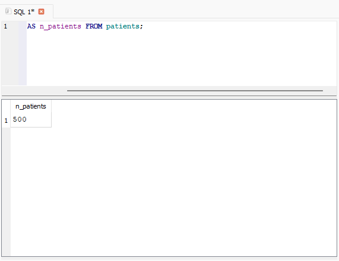
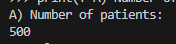
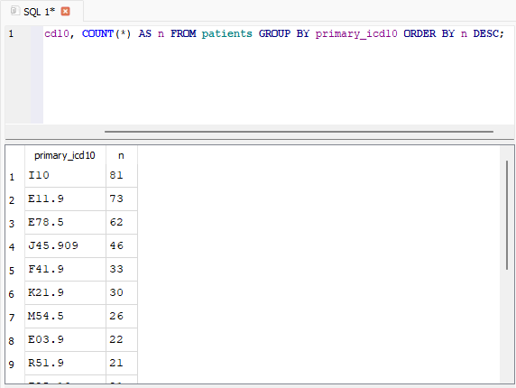
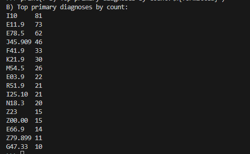
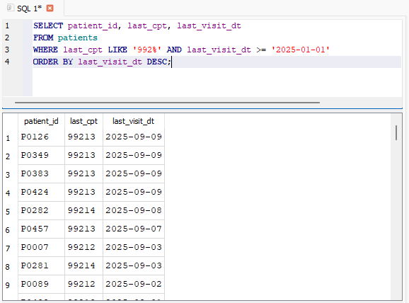
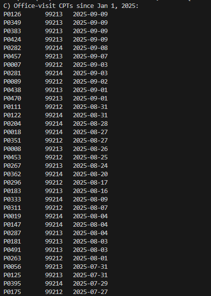
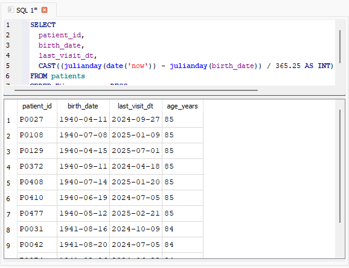
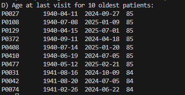
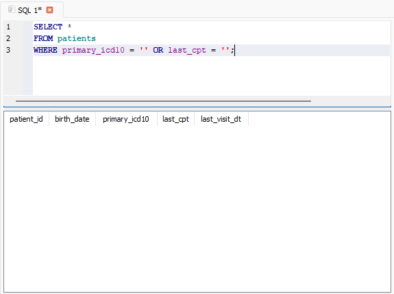

## Project Overview  
A lightweight SQLite workflow for managing patient data. Includes schema creation, CSV import, and diagnostic SQL queries. Designed for clarity, reproducibility, and modularity.

---
## Folder Structure  
```
Health-SQLite-Lite/
├── clinic_simple.db         # Generated SQLite database  
├── images/                  # png files
├── data/                    # Patient CSV file  
│   └── patients.csv  
├── sql/                     # Schema and analysis queries  
│   └── analysis.sql  
│   └── schema.sql  
├── src/                     # Python scripts for DB creation and data import  # Anaysis results
│   ├── create_db.py  
│   └── import_csv.py  
│   └── analysis.py  
└── requirements.txt         # Python dependencies  
```

---
## How to Run

1. **Step 1: Install dependencies**  
   ```bash
   pip install -r requirements.txt
   ```

2. **Step 2: Create the database**  
   ```bash
   python src/create_db.py
   ```

3. **Step 3: Load the CSV into the database**  
   ```bash
   python src/import_csv.py
   ```

4. **Explore the data**  
   Open `clinic_simple.db` in [DB Browser for SQLite](https://sqlitebrowser.org/) and run the query in `sql/analysis.sql`.

---
## `Requirements.txt`
```txt
Pandas
SQLAlchemy
```

## `Analysis: SQLite verus Python Results Output`
1. **Row Count** 


   

2. **Top primary diagnoses by count**




3. **Office-visit CPTs since Jan 1, 2025 (CPT codes starting with 992)**


 

4. **Age (approx) at last visit for the 10 oldest patients**


 

5. **Quick data quality check: any blank codes?**


